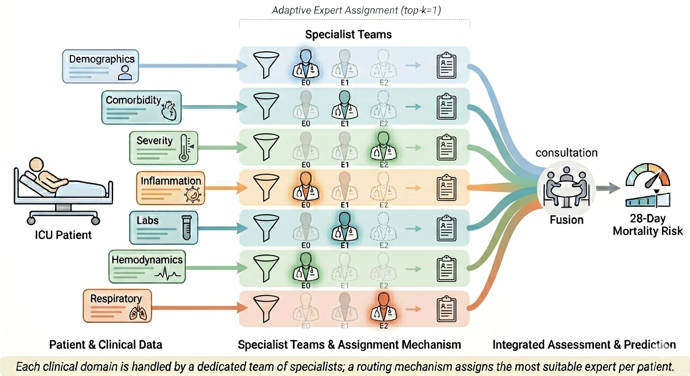

# FGA-MoE: Feature-Group-Aware Mixture of Experts

**A domain-aware sparse Mixture-of-Experts framework for 28-day mortality prediction in septic patients with coronary artery disease (CAD).**

<p align="center">
  
</p>

FGA-MoE shifts the routing granularity of conventional Mixture-of-Experts from the token/sample level to the **feature-group level**. The clinical feature space is partitioned into seven domain-specific groups (demographics, comorbidity, severity, inflammation, labs, hemodynamics, respiratory); each group has its own encoder, router, and expert pool, so a single patient is simultaneously routed to a different specialist expert in each clinical domain. With top-$k$=1 routing, only 7 of the 21 total experts are activated per inference pass.

---

## Highlights

- **Feature-group-level routing.** Unlike conventional MoE architectures that route at the token or sample level with a single shared router, FGA-MoE assigns one dedicated router and expert pool per clinical domain, mirroring the workflow of a multi-disciplinary clinical team.
- **Sparse and efficient inference.** Only one expert per group is activated per patient (7 of 21 total), yielding sparse inference while preserving strong discriminative power.
- **Unsupervised patient phenotyping.** Expert-specialization analysis shows that routers self-organize patients into clinically coherent subtypes without explicit supervision.
- **Clean, modular implementation.** Independent modules for group encoders, experts, router, and fusion make the architecture easy to extend or ablate.
- **Reproducible evaluation.** Bootstrap 95% confidence intervals for AUROC / AUPRC / F1 are built into the evaluation pipeline.

---

## Repository Structure

```
medi_moe/
├── main.py                    # Entry point: trains baseline + ablation configurations
├── config.py                  # Feature groups, hyperparameters, ablation configs
├── preprocessing.py           # Per-group preprocessing (encoding, log-transform, scaling)
├── groupwise_moe_model.py     # FGA-MoE architecture (GroupEncoder / Expert / Router / Fusion)
├── train_moe.py               # Training loop (AdamW, load-balance loss, early stopping)
├── evaluation.py              # Metrics + bootstrap confidence intervals
├── evaluate_all.py            # Reload saved checkpoints and re-run evaluation
├── assets/
│   └── experts.png            # Conceptual diagram
├── requirements.txt
└── README.md
```

> Only the model architecture, training, and evaluation code is released. Raw data, trained weights, and experimental results are **not** included in this repository.

---

## Installation

The project is developed on Python 3.10+ with PyTorch.

```bash
git clone https://github.com/<your-username>/FGA-MoE.git
cd FGA-MoE
pip install -r requirements.txt
```

If you use conda:

```bash
conda create -n fga_moe python=3.10 -y
conda activate fga_moe
pip install -r requirements.txt
```

GPU is recommended but not required; the code automatically falls back to CPU.

---

## Data

**The datasets used in this study are not included in this repository and must be obtained independently.** Access is governed by PhysioNet's credentialed-access policy, which requires completion of a recognized human-subjects research training course (e.g., CITI) and a signed data-use agreement.

- **MIMIC-IV (v2.2)**: <https://physionet.org/content/mimiciv/2.2/>
- **eICU Collaborative Research Database (v2.0)**: <https://physionet.org/content/eicu-crd/2.0/>
- **MIMIC Code Repository** (for Sepsis-3 and other derived tables): <https://github.com/MIT-LCP/mimic-code>

After obtaining access, you will need to:

1. Extract the septic-CAD cohort following the inclusion/exclusion criteria described in our paper.
2. Compute the per-patient averaged features listed in `config.FEATURE_GROUPS` across the 6 h pre- to 24 h post-ICU-admission window.
3. Save the resulting table as `data/eicu_mimiciv_sepsis_cad_final.csv` (path configurable in `config.DATA_PATH`).

The expected columns are the union of features declared in `FEATURE_GROUPS` plus the binary outcome column `has_survived_28days` (1 = survived to 28 days, 0 = died).

---

## Quick Start

### 1. Train the full model and run the ablation study

```bash
python main.py
```

This trains the full FGA-MoE model and all ablation variants defined in `config.ABLATION_CONFIGS`, saves checkpoints under `models/`, and writes metrics to `results/ablation_results.csv`.

### 2. Re-evaluate saved checkpoints

```bash
python evaluate_all.py
```

Reloads every `models/*_seed39.pt` checkpoint, reproduces the exact train/val/test split, and recomputes AUROC / AUPRC / F1 with 95% bootstrap CIs.

### 3. Customize the architecture

All architectural knobs (number of experts per group, top-$k$, expert/encoder/fusion hidden dims, dropout, load-balance weight, attention fusion toggle, etc.) are exposed in `config.BASELINE_MOE_CONFIG`. To define a new variant, add a dict to `ABLATION_CONFIGS` following the existing pattern.

---

## Architecture Overview

```
 ┌─ Demographics  ─▶ Encoder₁ ─▶ Router₁ ─▶ { E₁₁, E₁₂, E₁₃ } ─▶ top-k=1 ─┐
 │  Comorbidity   ─▶ Encoder₂ ─▶ Router₂ ─▶ { E₂₁, E₂₂, E₂₃ } ─▶ top-k=1 ─┤
 │  Severity      ─▶ Encoder₃ ─▶ Router₃ ─▶ { E₃₁, E₃₂, E₃₃ } ─▶ top-k=1 ─┤
Patient ─┤  Inflammation  ─▶ Encoder₄ ─▶ Router₄ ─▶ { E₄₁, E₄₂, E₄₃ } ─▶ top-k=1 ─┼─▶ Fusion ─▶ Risk
 │  Labs          ─▶ Encoder₅ ─▶ Router₅ ─▶ { E₅₁, E₅₂, E₅₃ } ─▶ top-k=1 ─┤
 │  Hemodynamics  ─▶ Encoder₆ ─▶ Router₆ ─▶ { E₆₁, E₆₂, E₆₃ } ─▶ top-k=1 ─┤
 └─ Respiratory   ─▶ Encoder₇ ─▶ Router₇ ─▶ { E₇₁, E₇₂, E₇₃ } ─▶ top-k=1 ─┘
```

Total experts: 7 groups × 3 experts = 21. Active experts per forward pass: 7.

Training uses AdamW with `BCEWithLogitsLoss`, an MSE-style load-balance auxiliary loss on mean gate probabilities, gradient clipping, cosine-annealing-with-warm-restarts scheduling, and early stopping on validation BCE loss.

---

## License

Released under the MIT License (see `LICENSE`).

## Acknowledgments

This work builds on the MIMIC-IV and eICU critical care databases maintained by the MIT Laboratory for Computational Physiology.
